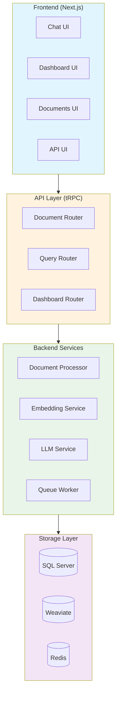
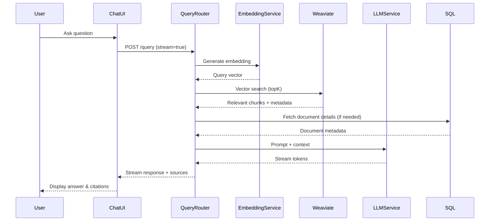

# Matjenin

<p align="center">
  
  
  
  
  
</p>

<p align="center">
  <strong>Next-Gen Vector Search Platform for AI Applications</strong>
</p>

> Matjenin is a powerful multi-tenant vector database and Retrieval-Augmented Generation (RAG) platform that combines semantic search with large language models. It enables developers to build AI-powered applications with intelligent document retrieval, real-time streaming responses, and transparent AI reasoning.

## 📋 Table of Contents

- [✨ Features](#features)
- [🏗️ Architecture](#architecture)
- [🔄 Data Flow](#data-flow)
- [🚀 Getting Started](#getting-started)
- [📖 Usage](#usage)
- [📁 Project Structure](#project-structure)
- [🔧 Configuration](#configuration)
- [🛠️ Available Scripts](#available-scripts)
- [🔐 Environment Variables](#environment-variables)
- [🤝 Contributing](#contributing)
- [📄 License](#license)
- [🙏 Acknowledgments](#acknowledgments)

## ✨ Features

## v1.0.14

### Core Capabilities
- **Vector Storage & Search** - Store and query high-dimensional embeddings with HNSW indexing for fast retrieval
- **Multi-Tenant Architecture** - Complete data isolation with tenant-specific limits and role-based access control
- **Document Processing** - Automatic chunking, embedding generation, and metadata extraction from PDFs, text files, and more
- **RAG Chat Interface** - Conversational AI that answers questions based on your documents
- **Real-time Streaming** - Token-by-token streaming with chain-of-thought visualization
- **Source Citations** - AI responses include citations to source documents

### AI & ML
- **Multi-Provider Support** - OpenAI, Anthropic, Google Gemini, Groq, DeepSeek, Cerebras, Mistral, Ollama, xAI
- **Semantic Search** - Find semantically similar documents using cosine similarity and HNSW indexing
- **Hybrid Search** - Combine keyword and vector search for optimal results
- **Intelligent Re-ranking** - Cross-encoder re-ranking for improved relevance

### Enterprise Features
- **API Key Authentication** - Programmatic access with granular permissions
- **Rate Limiting** - Configurable RPM/RPH limits per tenant
- **Audit Logging** - Complete audit trail of all operations
- **Usage Metrics** - Track API requests, tokens, storage, and more
- **Session Management** - Secure session-based authentication

## 🏗️ Architecture

The platform follows a modular architecture with clear separation of concerns:



### Technology Stack

| Layer | Technology |
|-------|------------|
| **Frontend** | Next.js 16, React 19, TypeScript, Tailwind CSS, Radix UI |
| **API** | tRPC v11, Zod |
| **Database** | SQL Server via Prisma ORM |
| **Vector DB** | Weaviate |
| **Queue** | BullMQ + Redis |
| **AI SDK** | Vercel AI SDK |
| **LLM Providers** | OpenAI, Anthropic, Google, Groq, DeepSeek, Cerebras, Mistral, Ollama, xAI |

## 🔄 Data Flow

### RAG Query Flow

When a user asks a question, the system performs a retrieval-augmented generation cycle:



### Document Processing Pipeline

Uploaded documents go through an automated pipeline to become searchable:


## 🚀 Getting Started

### Prerequisites

- Node.js 18+
- Docker & Docker Compose
- SQL Server (or use provided docker-compose)
- Redis
- Weaviate

### Quick Start

1. **Clone the repository**

```bash
git clone https://github.com/yourusername/matjenin-ai.git
cd matjenin-ai
```

2. **Install dependencies**

```bash
npm install
```

3. **Start infrastructure services**

```bash
docker-compose up -d
```

This starts:
- SQL Server on port 1433
- Redis on port 6379
- Weaviate on port 8080

4. **Configure environment variables**

Create a `.env` file:

```env
# Database
DATABASE_URL="sqlserver://localhost:1433;database=matjenin_ai;user=sa;password=YourStrong!Password;trustServerCertificate=true"

# Redis
REDIS_URL="redis://localhost:6379"

# Weaviate
WEAVIATE_URL="http://localhost:8080"

# OpenAI (or other providers)
OPENAI_API_KEY="your-openai-api-key"
ANTHROPIC_API_KEY="your-anthropic-api-key"
GOOGLE_API_KEY="your-google-api-key"

# App Config
NEXTAUTH_SECRET="your-secret-key"
```

5. **Initialize database**

```bash
npm run db:generate
npm run db:push
```

6. **Start development server**

```bash
npm run dev
```

Visit [http://localhost:3000](http://localhost:3000) to see the application.

## 📖 Usage

### Upload Documents

Navigate to `/documents` to upload documents for processing. The system will:
- Parse the document content
- Split into chunks
- Generate embeddings
- Store in Weaviate

### Chat with Your Documents

Use the chat interface at `/chat` to ask questions about your documents. The AI will:
1. Convert your question to a vector embedding
2. Search for similar document chunks
3. Generate a response with citations

## API Usage

### Query with Streaming

```typescript
const response = await fetch('/api/query/stream', {
  method: 'POST',
  headers: { 'Content-Type': 'application/json' },
  body: JSON.stringify({
    message: "What is the main topic?",
    stream: true,
    includeReasoning: true,
    includeSources: true
  })
});

const reader = response.body.getReader();
const decoder = new TextDecoder();

while (true) {
  const { done, value } = await reader.read();
  if (done) break;
  console.log(decoder.decode(value));
}
```

### Search Documents

```typescript
const results = await fetch('/api/query', {
  method: 'POST',
  headers: { 'Content-Type': 'application/json' },
  body: JSON.stringify({
    query: "artificial intelligence",
    topK: 10,
    includeMetadata: true,
    rerank: true,
    hybridSearch: true
  })
});

const { documents, scores } = await results.json();
```

#### Upload Document

```typescript
const formData = new FormData();
formData.append('file', file);
formData.append('chunkSize', '512');
formData.append('overlap', '50');

const result = await fetch('/api/documents', {
  method: 'POST',
  body: formData
});

const { documentId, chunks, status } = await result.json();
```

## 📁 Project Structure

```
matjenin-ai/
├── app/                      # Next.js App Router
│   ├── api/                  # API routes
│   │   ├── documents/        # Document upload & management
│   │   ├── query/            # RAG query endpoints
│   │   └── trpc/             # tRPC API
│   ├── chat/                 # Chat interface
│   ├── dashboard/            # Dashboard & analytics
│   ├── documents/            # Document management UI
│   └── worker/               # Background job worker
├── components/               # React components
│   ├── ai-elements/          # AI UI components (chat, reasoning, etc.)
│   └── ui/                   # Base UI components
├── docs/                     # Additional documentation
├── hooks/                    # Custom React hooks
├── lib/                      # Utility functions
├── sdk/                      # SDK modules
│   ├── cache/                # Caching utilities
│   ├── db/                   # Database (Prisma)
│   ├── llm/                  # LLM integrations
│   ├── ml/                   # ML utilities
│   ├── models/               # Model providers
│   ├── queue/                # Job queue
│   ├── vector/               # Vector operations
│   └── skills/               # AI skills & capabilities
├── server/                   # Server-side code
│   └── trpc/                 # tRPC router & procedures
├── types/                    # TypeScript types
├── package.json
├── next.config.js
├── prisma.config.ts
├── tsconfig.json
└── docker-compose.yml
```

## 🔧 Configuration

### Tenant Limits

Configure tenant-specific limits in the database:

| Limit | Description | Default |
|-------|-------------|---------|
| `maxUsers` | Maximum users per tenant | 5 |
| `maxDocuments` | Maximum documents | 100 |
| `maxStorageMb` | Storage limit (MB) | 1000 |
| `rateLimitRpm` | Requests per minute | 60 |
| `rateLimitRph` | Requests per hour | 1000 |

### Plans

- **Free** - Basic features with limited usage
- **Pro** - Higher limits, priority support
- **Enterprise** - Custom limits, dedicated database, SLA

## 🛠️ Available Scripts

| Command | Description |
|---------|-------------|
| `npm run dev` | Start development server |
| `npm run build` | Build for production |
| `npm run start` | Start production server |
| `npm run lint` | Run linting |
| `npm run db:generate` | Generate Prisma client |
| `npm run db:push` | Push schema to database |
| `npm run worker` | Start background job worker |

## 🔐 Environment Variables

| Variable | Required | Description |
|----------|----------|-------------|
| `DATABASE_URL` | Yes | SQL Server connection string |
| `REDIS_URL` | Yes | Redis connection string |
| `WEAVIATE_URL` | Yes | Weaviate URL |
| `OPENAI_API_KEY` | No | OpenAI API key |
| `ANTHROPIC_API_KEY` | No | Anthropic API key |
| `GOOGLE_API_KEY` | No | Google AI API key |
| `GROQ_API_KEY` | No | Groq API key |
| `DEEPSEEK_API_KEY` | No | DeepSeek API key |

## 🤝 Contributing

Contributions are welcome! Please read our [contributing guidelines](CONTRIBUTING.md) first.

1. Fork the repository
2. Create a feature branch
3. Make your changes
4. Submit a pull request

## 📄 License

This project is licensed under the MIT License - see the [LICENSE](LICENSE) file for details.

---
## 🙏 Acknowledgments

- [Vercel AI SDK](https://sdk.vercel.ai/) - For the excellent AI streaming utilities
- [Weaviate](https://weaviate.io/) - For the vector database
- [Next.js](https://nextjs.org/) - For the amazing framework
- [tRPC](https://trpc.io/) - For type-safe APIs
---
