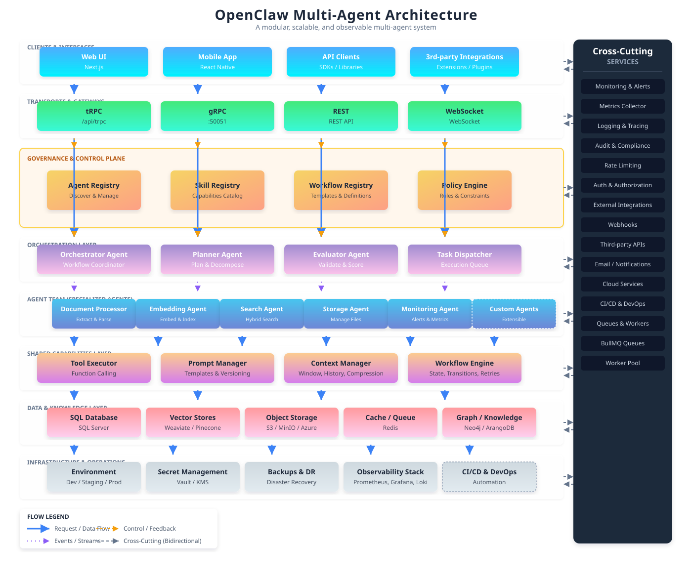
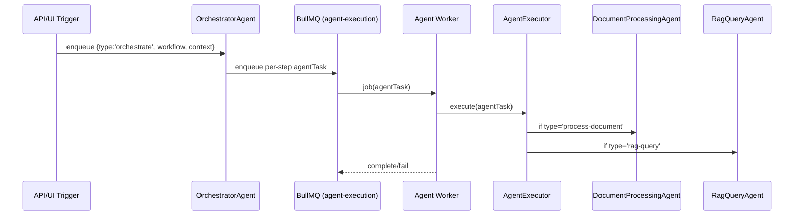
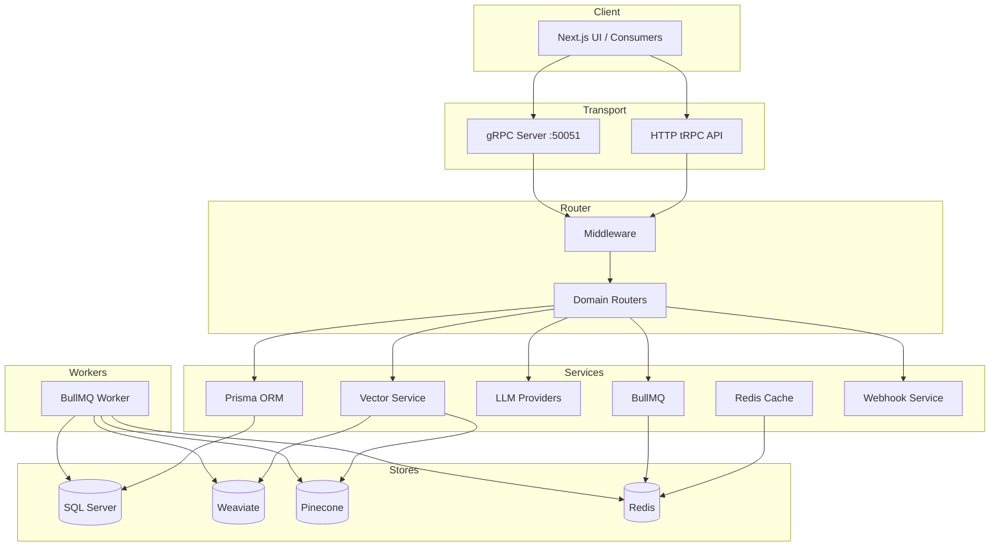
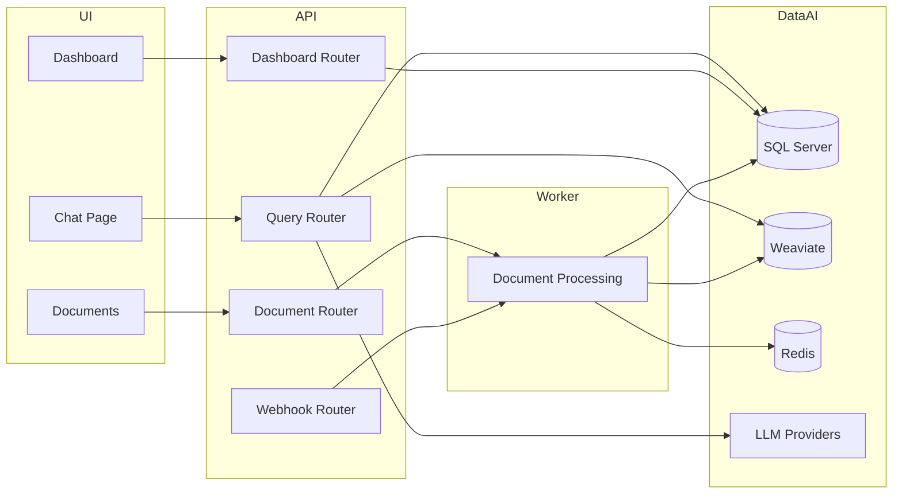
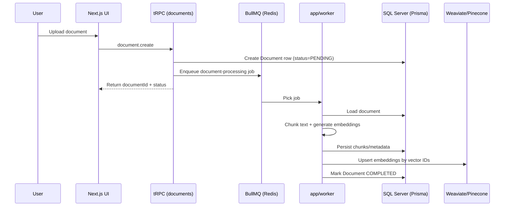
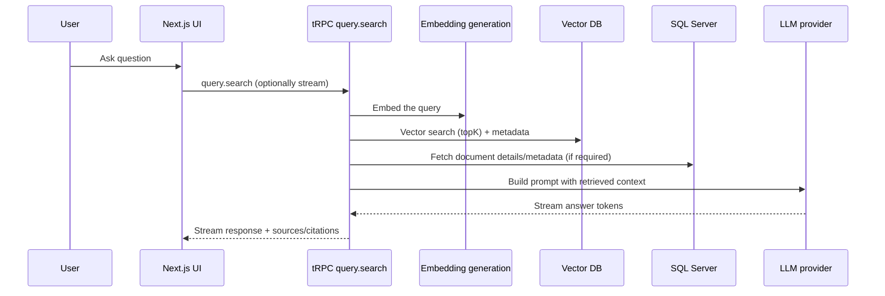

# Matjenin

<p align="center">
  
  
  
  
  
</p>

<p align="center">
  <strong>Multi-tenant Vector Search + Agentic RAG Platform</strong>
</p>

> Matjenin is a multi-tenant RAG platform that combines document ingestion, vector search (Weaviate/Pinecone), background processing (BullMQ/Redis), and multi-provider LLM orchestration.

---

## Quick Links

- [Architecture](#architecture)
- [Data Flow](#data-flow)
- [API Surfaces](#api-surfaces)
- [Getting Started (Local)](#getting-started-local)
- [Docker Compose (Local)](#docker-compose-local)
- [Configuration](#configuration)
- [Deployment Notes](#deployment-notes)

---

## Architecture

### OpenClaw multi-agent architecture (diagram)




### OpenClaw multi-agent architecture (repo-specific)

Matjenin implements OpenClaw-style multi-agent orchestration using:

- **OrchestratorAgent** (`sdk/agents/orchestrator/orchestrator-agent.ts`): runs multi-step workflows by *enqueuing* agent tasks.
- **AgentExecutor** (`sdk/agents/orchestrator/executor.ts`): routes each queued `agentTask` to the correct specialized agent.
- **Specialized agents**:
  - **DocumentProcessingAgent** (`sdk/agents/adapters/document-processing-agent.ts`): chunk → embed → persist (SQL) and optionally upsert to Pinecone.
  - **RagQueryAgent** (`sdk/agents/adapters/rag-query-agent.ts`): delegates retrieval + answer generation to `ragService.search()`.
- **Worker entry points**:
  - `app/worker/index.ts`: document-processing pipeline worker.
  - `app/worker/agent-executor.ts`: consumes the `agent-execution` queue and executes `agentTask`s.



---

### High-level system model





### Component responsibilities



---

## Data Flow

### Document ingestion lifecycle



### RAG query lifecycle (search + generation)



---

## API Surfaces

### 1) tRPC over HTTP (primary)
- Routes are mounted under `app/api/trpc/**`.
- Used by the Next.js frontend via `@trpc/next` and React Query.

### 2) gRPC (service-to-service)
- gRPC server runs via `server/grpc/server.ts`.
- Exposed on port `50051` (see `Dockerfile.grpc`).

---

## Getting Started (Local)

### Prerequisites
- Node.js 18+
- Docker + Docker Compose

### 1) Start infrastructure

```bash
docker-compose up -d
```

This starts:
- SQL Server on **1433**
- Redis on **6379**
- Weaviate on **8080**

### 2) Configure environment variables

Create a `.env` file:

```env
# SQL Server
DATABASE_URL="sqlserver://localhost:1433;database=matjenin_ai;user=sa;password=YourStrong!Password123;trustServerCertificate=true"

# Redis
REDIS_URL="redis://localhost:6379"

# Weaviate
WEAVIATE_URL="http://localhost:8080"

# App secret
NEXTAUTH_SECRET="your-secret-key"

# LLM provider keys (set whichever providers you use)
OPENAI_API_KEY="your-openai-api-key"
ANTHROPIC_API_KEY="your-anthropic-api-key"
GOOGLE_API_KEY="your-google-api-key"
```

### 3) Initialize database

```bash
npm run db:generate
npm run db:push
```

### 4) Run the app

```bash
npm run dev
```

Visit:
- http://localhost:3000

---

## Docker Compose (Local)

`docker-compose.yml` defines:
- **SQL Server** (`mcr.microsoft.com/mssql/server:2022-latest`)
- **Redis** (`redis:7-alpine`)
- **Weaviate** (`semeitechnologies/weaviate:latest`)

---

## Configuration

### Tenant limits (database)
Tenant plan/limits are represented in `prisma/schema.prisma` under `Tenant`.

Typical fields:
- `maxUsers` (default: 5)
- `maxDocuments` (default: 100)
- `maxStorageMb` (default: 1000)
- `rateLimitRpm` (default: 60)
- `rateLimitRph` (default: 1000)

### Environment variables

| Variable | Required | Purpose |
|---|---:|---|
| `DATABASE_URL` | Yes | SQL Server connection string |
| `REDIS_URL` | Yes | Redis connection string |
| `WEAVIATE_URL` | Yes | Weaviate endpoint |
| `NEXTAUTH_SECRET` | Yes | Session/auth secret |
| Provider keys | No (per provider) | `OPENAI_API_KEY`, `ANTHROPIC_API_KEY`, `GOOGLE_API_KEY`, etc. |

---

## Deployment Notes

Matjenin uses a **hybrid deployment strategy** because the worker and gRPC server require long-running processes.

- **Vercel**: Next.js app + tRPC HTTP endpoints
- **Worker host** (Railway/Fly.io/AWS ECS): BullMQ worker process (`npm run worker`)
- **gRPC host** (Railway/Fly.io/AWS ECS/EC2): persistent TCP server (`npm run grpc`)

See `docs/DEPLOYMENT.md` for the full deployment checklist.

---

## Scripts

Common commands from `package.json`:
- `npm run dev`
- `npm run build`
- `npm run start`
- `npm run lint`
- `npm run typecheck`
- `npm run db:generate`
- `npm run db:push`
- `npm run worker`
- `npm run grpc`

---

## Contributing

Contributions are welcome. See `CONTRIBUTING.md`.

---

## License

Licensed under the repository `LICENSE` file.

