# Matjenin Architecture

**Last Updated:** 17th February 2026  
**Version:** 1.0.15

## Table of Contents

1. [System Overview](#system-overview)
2. [Technology Stack](#technology-stack)
3. [High-Level Architecture](#high-level-architecture)
4. [Component Architecture](#component-architecture)
5. [Data Architecture](#data-architecture)
6. [API Architecture](#api-architecture)
7. [Processing Pipeline](#processing-pipeline)
8. [Security Architecture](#security-architecture)
9. [Deployment Architecture](#deployment-architecture)

---

## System Overview

Matjenin is a multi-tenant vector database and Retrieval-Augmented Generation (RAG) platform that combines semantic search with large language models. It enables developers to build AI-powered applications with:

- Intelligent document retrieval
- Real-time streaming responses
- Transparent AI reasoning
- Multi-tenant data isolation

### Core Capabilities

| Capability | Description |
|------------|-------------|
| Vector Storage & Search | Store and query high-dimensional embeddings with HNSW indexing |
| Multi-Tenant Architecture | Complete data isolation with tenant-specific limits |
| Document Processing | Automatic chunking, embedding generation, and metadata extraction |
| RAG Chat Interface | Conversational AI that answers questions based on documents |
| Real-time Streaming | Token-by-token streaming with chain-of-thought visualization |
| Multi-Provider Support | OpenAI, Anthropic, Google, Groq, DeepSeek, and more |

---

## Technology Stack

### Core Framework

| Layer | Technology | Version |
|-------|------------|---------|
| Runtime | Node.js | 18+ |
| Web Framework | Next.js | 16.x |
| UI Library | React | 19.x |
| Language | TypeScript | 5.9.x |
| Styling | Tailwind CSS | 4.x |

### Backend Services

| Component | Technology |
|-----------|------------|
| API Layer | tRPC v11 |
| Validation | Zod |
| Database ORM | Prisma 7.4 |
| Primary Database | SQL Server |
| Vector Database | Weaviate |
| Message Queue | BullMQ + Redis |
| gRPC Server | @grpc/grpc-js |

### AI & ML

| Component | Technology |
|-----------|------------|
| AI SDK | Vercel AI SDK |
| Embeddings | Transformers.js (Xenova/all-MiniLM-L6-v2) |
| LLM Providers | OpenAI, Anthropic, Google, Groq, DeepSeek, Cohere |

### UI Components

| Component | Technology |
|-----------|------------|
| Base UI | Radix UI |
| Icons | Lucide React |
| Animations | Framer Motion |
| Charts | Custom (Dashboard) |

---

## High-Level Architecture

```mermaid
graph TB
    subgraph "Client Layer"
        Web[Web App<br/>Next.js/React]
        Mobile[Mobile App<br/>React Native]
        ChatUI[Chat UI]
        API[API Client]
    end

    subgraph "API Gateway"
        Next[Next.js Server]
        tRPC[tRPC Router]
        REST[REST API]
        WS[WebSocket]
        gRPC[gRPC Gateway]
    end

    subgraph "Service Layer"
        DocSvc[Document Service]
        EmbedSvc[Embedding Service]
        LLMSvc[LLM Service]
        QueueSvc[Queue Service]
    end

    subgraph "SDK Layer"
        DB[(DB SDK)]
        Vector[(Vector SDK)]
        LLM[(LLM SDK)]
        Queue[(Queue SDK)]
    end

    subgraph "Data Layer"
        SQL[(SQL Server)]
        Weaviate[(Weaviate)]
        Redis[(Redis)]
    end

    Web --> Next
    Mobile --> Next
    ChatUI --> Next
    API --> Next

    Next --> tRPC
    Next --> REST
    Next --> WS
    Next --> gRPC

    tRPC --> DocSvc
    tRPC --> EmbedSvc
    tRPC --> LLMSvc
    tRPC --> QueueSvc

    DocSvc --> DB
    EmbedSvc --> Vector
    LLMSvc --> LLM
    QueueSvc --> Queue

    DB --> SQL
    Vector --> Weaviate
    Queue --> Redis

    LLMSvc --> LLM SDK
    LLM SDK --> OpenAI
    LLM SDK --> Anthropic
    LLM SDK --> Google
    LLM SDK --> Groq
    LLM SDK --> DeepSeek
```

---

## Component Architecture

### Frontend Component Hierarchy

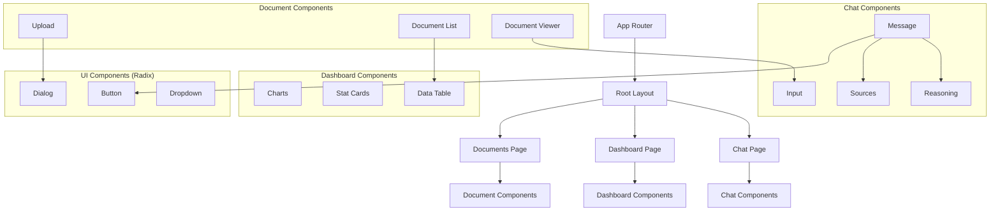

### Application Routes Structure

```mermaid
graph LR
    subgraph "App Router"
        Home[/] --> Landing[Landing Page]
        Home --> ChatRoute[/chat]
        Home --> DashboardRoute[/dashboard]
        Home --> DocumentsRoute[/documents]
        Home --> ApiRoute[/api]
        
        ChatRoute --> Conversation[Conversation ID]
        DashboardRoute --> Stats[Stats Page]
        DocumentsRoute --> DocID[Document ID]
        
        ApiRoute --> TRPC[/api/trpc]
        ApiRoute --> Query[/api/query]
        ApiRoute --> Stream[/api/query/stream]
        ApiRoute --> Upload[/api/documents]
    end
```

### SDK Module Organization

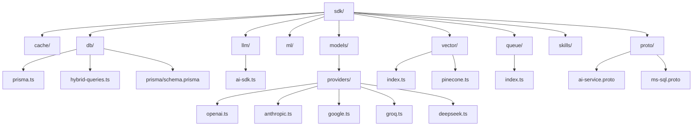

---

## Data Architecture

### Entity Relationship Diagram

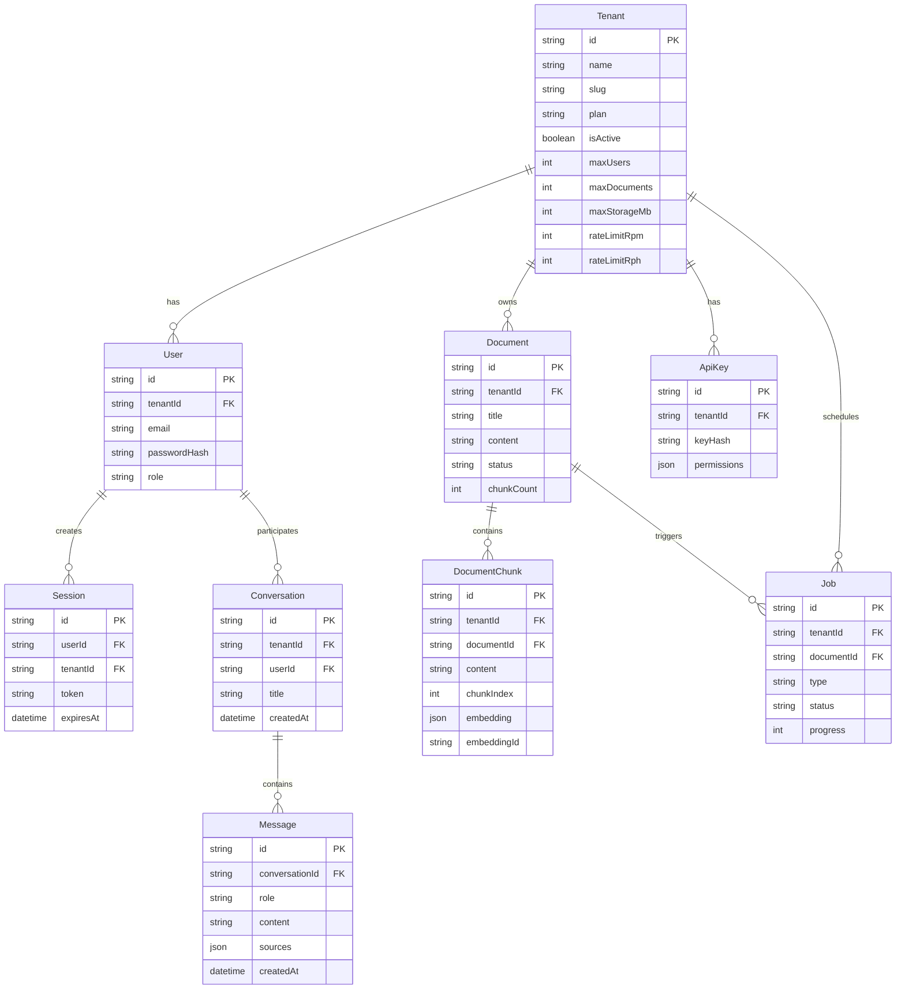

### Multi-Tenant Data Isolation Flow

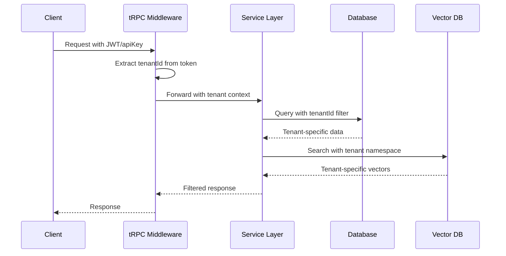

---

## API Architecture

### tRPC Router Structure

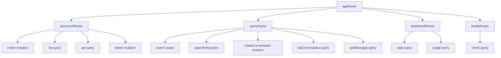

### Middleware Pipeline

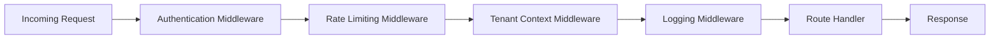

### API Request Flow

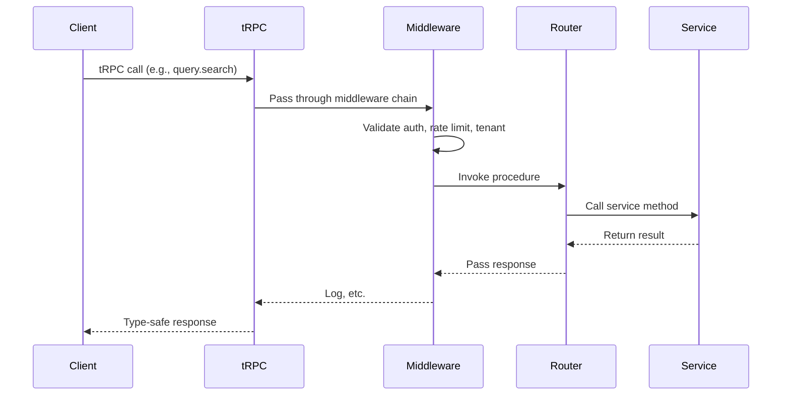

---

## Processing Pipeline

### Document Processing Flow

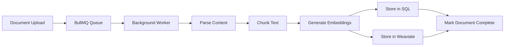

### RAG Query Flow

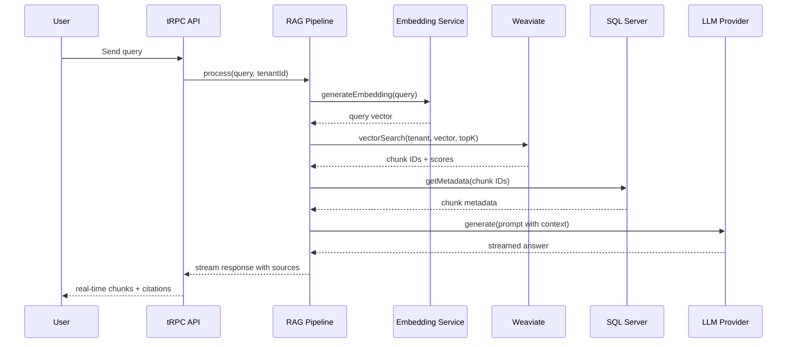

### Background Job Processing

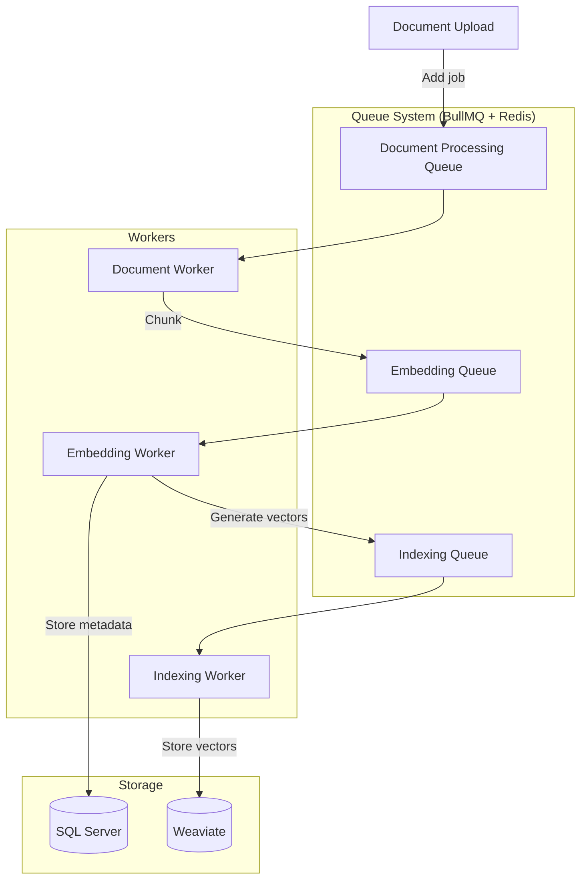

---

## Security Architecture

### Authentication Flow

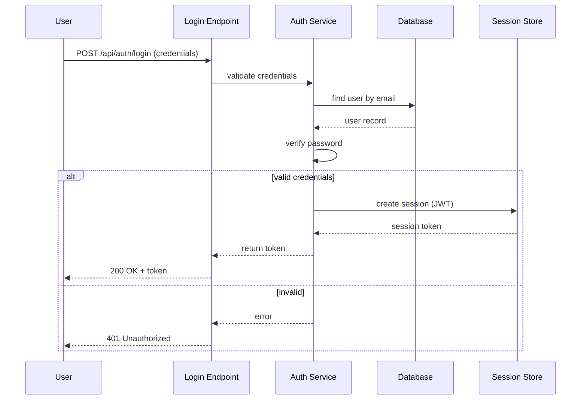

### Security Layers

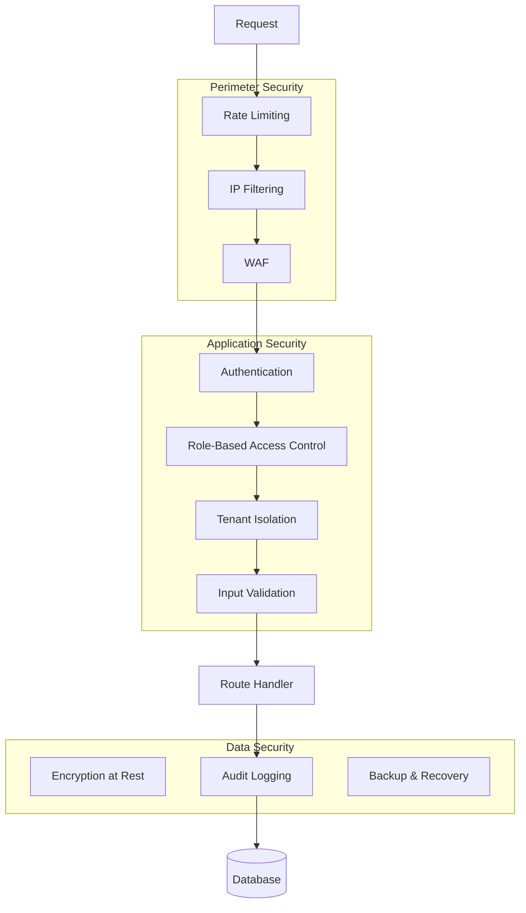

---

## Deployment Architecture

### Infrastructure Components

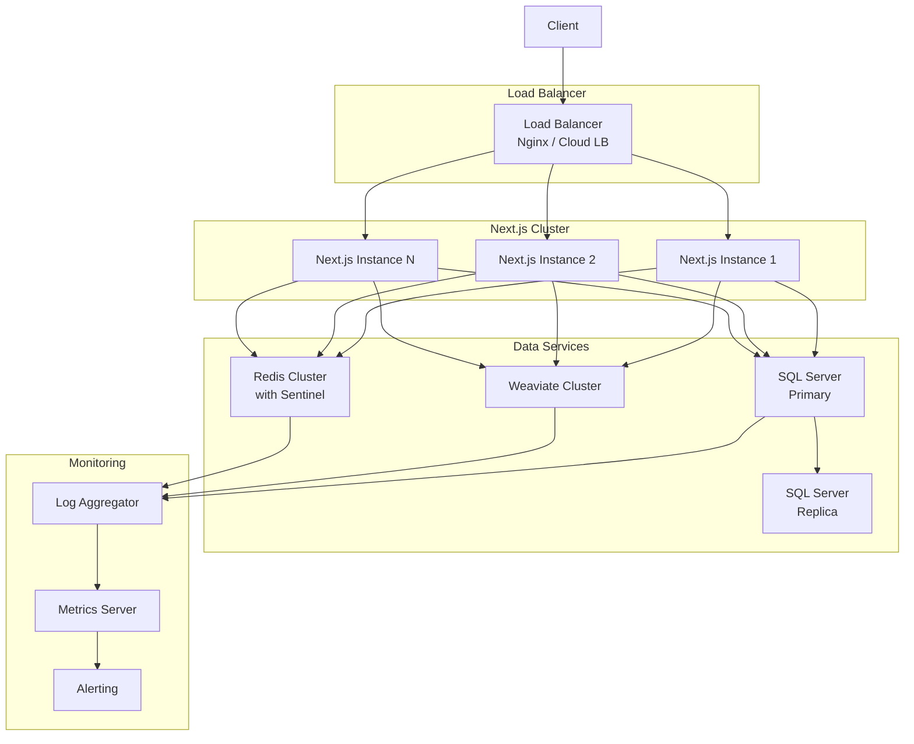

### Docker Services

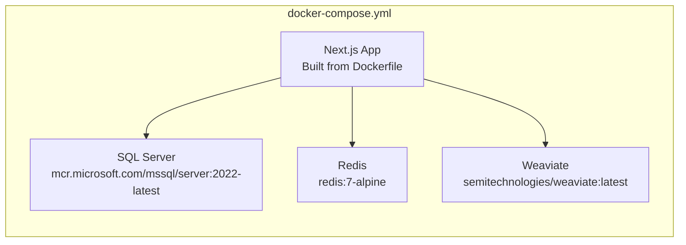

---

## Development Guidelines

### Project Structure

```mermaid
graph TD
    Root[/] --> App[app/]
    Root --> Components[components/]
    Root --> SDK[sdk/]
    Root --> Server[server/]
    Root --> Lib[lib/]
    Root --> Types[types/]
    
    App --> API[api/]
    App --> Chat[chat/]
    App --> Dashboard[dashboard/]
    App --> Documents[documents/]
    
    Components --> AI[ai-elements/]
    Components --> UI[ui/]
    
    SDK --> DB[db/]
    SDK --> LLM[llm/]
    SDK --> Vector[vector/]
    SDK --> Queue[queue/]
    
    Server --> TRPC[trpc/]
    TRPC --> Routers[routers/]
```

### Adding New Features Workflow

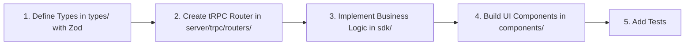

---

## Appendix

### Glossary

| Term | Definition |
|------|------------|
| **RAG** | Retrieval-Augmented Generation - AI technique combining LLM with document search |
| **HNSW** | Hierarchical Navigable Small World - Vector indexing algorithm |
| **Embedding** | Numerical vector representation of text for semantic search |
| **Chunk** | Segment of document text for vector storage |
| **Tenant** | Isolated customer/account in multi-tenant system |

### Performance Considerations

- **Vector Search**: Use Weaviate with HNSW index for sub-100ms queries
- **Document Processing**: Process in background with BullMQ for non-blocking uploads
- **LLM Streaming**: Use Vercel AI SDK for efficient token streaming
- **Caching**: Implement Redis caching for frequently accessed data

### Monitoring & Observability

- **OpenTelemetry** integration for distributed tracing
- **Prisma Studio** for database inspection
- **BullMQ Dashboard** for job queue monitoring

---

- * *Last Updated: 17th February 2026*
- * *Version: 1.0.15*
